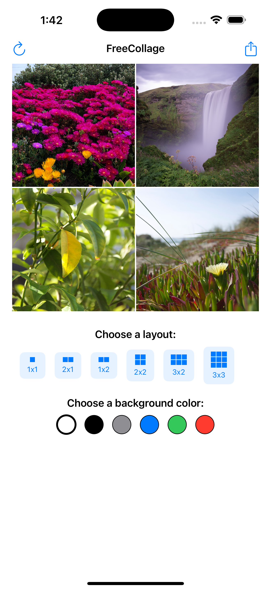

# FreeCollage
A simple and intuitive iPhone application for creating photo collages from your camera roll. Built with SwiftUI for iOS 17.0+.

## Features

  - Tap photos to add/replace them
  - Drag photos to reposition them within the canvas
  - Resize photos by dragging the corner handle when selected
  - Layer management (bring forward/send back)
  - Remove photos from grid cells
  - Choose from 6 background colors (white, black, gray, blue, green, red)
  - Default 1x1 grid layout on app launch
  - Share via iOS share sheet (includes save to Photos, Messages, Mail, Social Media, etc.)
  - One-tap sharing with standard iOS share icon
  - Reset button to clear everything and start fresh
  - Visual selection indicators with blue borders
  - Responsive design with proper bounds checking

## Preview


## User Interface

### Toolbar
- **Reset Button** (left): Clears all content and returns to default 1x1 grid
- **Share Button** (right): Opens iOS share sheet with rendered collage

### Interaction Model
- **Single Tap**: Add or replace photo in any grid cell
- **Drag**: Select and move photos within the canvas
- **Resize Handles**: Appear on selected images for resizing

## Technical Details

- **Platform**: iOS 17.0+
- **Framework**: SwiftUI
- **Language**: Swift
- **Architecture**: MVVM pattern with state management optimizations
- **Image Storage**: Dictionary-based approach for optimal SwiftUI performance
- **Compiler Optimization**: Computed properties used to resolve Swift compilation timeouts

## Project Structure

```
FreeCollage/
├── FreeCollageApp.swift          # Main app entry point
├── ContentView.swift             # Home screen with photo selection
├── CollageView.swift             # Main collage editing interface
├── CollageItem.swift             # Data model for collage items
├── PhotoPickerView.swift         # Photo selection interface
├── GridLayoutView.swift          # Layout options and grid creation
├── ExportManager.swift           # Handle rendering and sharing
├── Assets.xcassets/             # App icons (iOS-only configuration)
├── Info.plist                   # App configuration and permissions
└── Preview Content/             # SwiftUI preview assets
```

## Key Components

### CollageView
The main editing interface featuring:
- Canvas area with visual grid and photo display
- Layout selection with live previews
- Background color picker
- Selected item controls for layer management
- Computed properties for performance optimization

### CollageItem
A data model representing each photo in the collage with properties for:
- Unique identifier (UUID)
- Position (x, y coordinates within canvas)
- Size (width, height)
- Rotation angle (currently unused)
- Selection state

### PhotoPickerView
SwiftUI wrapper around PHPickerViewController for native photo selection from the user's photo library.

### GridLayoutView
Handles layout creation and preview:
- Generates collage items based on selected grid dimensions
- Calculates proper positioning and sizing
- Provides visual layout previews

### ExportManager
Handles the export functionality:
- Renders the collage to UIImage using UIGraphicsImageRenderer
- Creates share sheets for iOS sharing system
- Manages export quality and format

## State Management

The app uses SwiftUI's state management with several optimizations:
- `@State` for UI state variables
- Dictionary-based image storage (`itemImages: [UUID: UIImage]`)
- Computed bindings for sheet presentation
- Force UI updates with refresh triggers when needed

## Building and Running

1. Open `FreeCollage.xcodeproj` in Xcode 15.0+
2. Select your target device or iOS Simulator (iOS 17.0+)
3. Build and run the project (⌘+R)

## Permissions

The app requires photo library access permission, declared in Info.plist:
- `NSPhotoLibraryUsageDescription`: "FreeCollage needs access to your photos to create collages."

## App Icons

Configured with iOS-only app icons (cleaned from original multi-platform setup):
- iPhone and iPad icons in standard sizes
- App Store icon (1024x1024)
- Removed watchOS and macOS icons for focused iOS experience

## Development Notes

### SwiftUI Optimizations Applied
- Complex view hierarchies broken into computed properties
- Toolbar content extracted to resolve ambiguous API usage
- Sheet presentation tied directly to data state for timing reliability

### Architecture Decisions
- Dictionary-based image storage instead of struct mutations for SwiftUI compatibility
- Computed bindings to eliminate race conditions in sheet presentation
- Separate view models for complex UI sections

## Future Enhancements

Potential features that could be added:
- Text overlay support
- Border and frame options
- More background color options or custom colors
- Rotation controls for individual images
- Undo/Redo functionality
- Save/Load collage projects
- Additional export formats

## License

This project is created for educational and personal use. Feel free to modify and enhance as needed.
